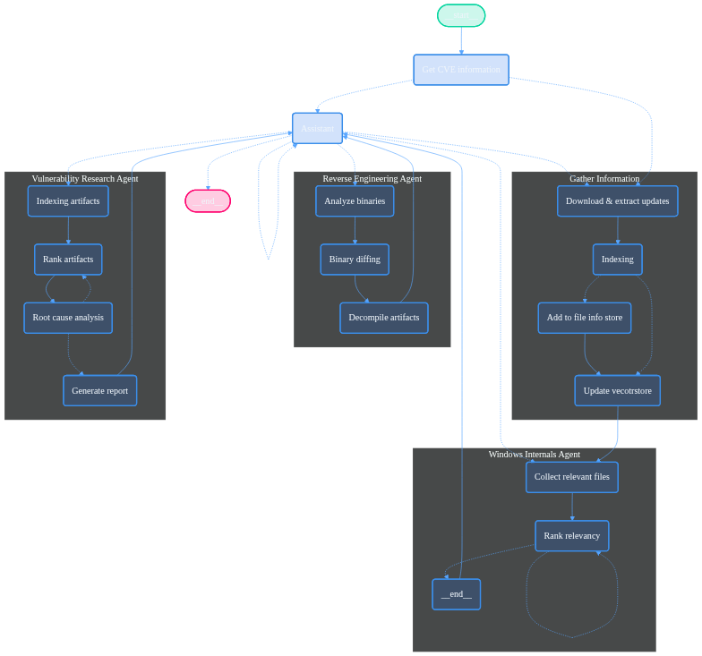
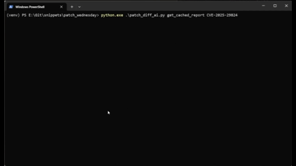

# PatchDiff-AI

**LangGraph‑powered multi‑agent system that turns batches of CVE IDs into fully‑fledged root‑cause reports.**

---

## Table of Contents

1. [Overview](#overview)
2. [Architecture](#architecture)
3. [Prerequisites](#prerequisites)
4. [Installation](#installation)
   * [4.1 Python 3.11](#41-python-311)
   * [4.2 IDA Pro 8.x](#42-ida-pro-8x)
   * [4.3 BinExport + BinDiff 8](#43-binexport--bindiff-8)
   * [4.4 Project dependencies](#44-project-dependencies)
5. [Quick Start](#quick-start)
6. [Sample Output](#sample-output)
7. [Extending the Graph](#extending-the-graph)
8. [Contributing](#contributing)
9. [License](#license)

---

## Overview

`PatchDiff-AI` is a Python-based, LangGraph-driven **multi-agent** system that **automates large-scale reverse-engineering**. Feed it a plain-text list of CVE identifiers, and it **spawns** a supervised multi-agent graph that decompiles the vulnerable component, correlates patched **and** unpatched binaries with BinDiff 8, and **generates** a detailed report for each vulnerability.

* **Parallel by default** – every CVE runs in its own instance of the graph.  
* **Deterministic supervision** – the top-level *Supervisor* node coordinates tool errors and time-outs so rogue sub-agents cannot derail the batch.  
* **Extensible** – new analysis stages are a single node away (see [Extending the Graph](#extending-the-graph)).

> **Supported OS:** **Windows only.** The system targets Microsoft Patch Tuesday updates, but contributors are welcome to extend it to other platforms (e.g., Android) or specific applications. It currently analyzes only CVEs that affect the host OS version.<br>
> **Tested on:** **Windows 11 24H2 x64**; other versions *should* work.

> ⚠ **Warning:** This project uses `chromadb`, which **has** a known crashing issue on some setups. If you **encounter** *Process finished with exit code -1073741819 (0xC0000005)*, the fault lies in `chromadb`/`HNSWlib`. Switch the virtual-machine engine or use a physical machine.

---

## Architecture



Each **Agent** is a subgraph and operates independently. Anyone can extend the system easily by containing the changes to the relevant graph.

---

## Prerequisites

| Tool          | Version         | Why                                     |
|---------------|-----------------|-----------------------------------------|
| **Python**    | 3.11 x64        | Developed and tested using this version |
| **IDA Pro**   | ≥ 8.0 and < 9.0 | Required by BinDiff 8                   |
| **BinDiff**   | 8.0             | Binary diffing engine                   |
| **BinExport** | ≥ 12            | IDA plugin that produces .BinDiff files |
| **7-zip**     | ≥ 22            | Used to extract the update archives     |

> **Licensing:** IDA Pro is commercial. Buy a legal copy or fork this repo and extend it to Ghidra.

---

## Installation

### 4.1 Python 3.11

Download *Windows x64* installer from [https://www.python.org/downloads/release/python-3119/](https://www.python.org/downloads/release/python-3119/). During setup **enable “Add to PATH”** and **“Install for all users”**.

```powershell
python --version  # should print 3.11.x
```

### 4.2 IDA Pro 8.x

1. Purchase / download IDA Pro 8.x from Hex‑Rays.
2. Run the installer.
3. Keep the default location (e.g. `C:\Program Files\IDA Pro 8.0`).
4. Check if the IDA has access to python by running commands in the GUI shell.
   If not, run `idapyswitch` as admin.

```powershell
"%IDA_PATH%\idapyswitch.exe"
```

### 4.3 BinExport + BinDiff 8

1. Download BinDiff 8 from Google Security Research.
2. Validate the following DLLs in the IDA *plugins* folder:
   * `%appdata%\Hex-Rays\IDA Pro\plugins`
     * `bindiff8_ida*.dll`
     * `binexport12_ida*.dll`
3. Restart IDA once to verify `Edit → Plugins → BinExport` is present.

### 4.4 Project dependencies

```powershell
# clone
> git clone <this repo>
> cd patchdiff_ai

# isolate
> python -m venv .venv
> .venv\Scripts\activate

# compile deps (langgraph, python-bindiff, etc.)
> pip install -r requirements.txt
```

---

## Quick Start
After installation, the fastest way to start your first analysis is to get CVE that affect your system from [MSRC](https://msrc.microsoft.com/update-guide/)
```powershell
> cd patchdiff_ai/
> python.exe .\patchdiff_ai.py cve CVE-2025-29824
```


You can also get a list of the CVEs that affect a certain system and even analyze all of them in parallel:
```powershell
> python.exe .\patchdiff_ai.py month 2025-May
```

<details>
  <summary>Click to expand the output</summary>

```powershell
Filter by name? [y/N] y
Platform name substring: windows 11
Possible matches:
1) Windows 11 HLK 22H2
2) Windows 11 HLK 24H2
3) Windows 11 Version 22H2 for ARM64-based Systems
4) Windows 11 Version 22H2 for x64-based Systems
5) Windows 11 Version 23H2 for ARM64-based Systems
6) Windows 11 Version 23H2 for x64-based Systems
7) Windows 11 Version 24H2 for ARM64-based Systems
8) Windows 11 Version 24H2 for x64-based Systems
Choose 1-8 [1]: 8
Selected product id: {'12390'}
List 2025-May CVEs for ['Windows 11 Version 24H2 for x64-based Systems'] - {'12390'}

 shape: (36, 2)
┌────────────────┬──────────────────────────────────────────────────────────────┐
│ CVE            ┆ Title                                                        │
│ ---            ┆ ---                                                          │
│ str            ┆ str                                                          │
╞════════════════╪══════════════════════════════════════════════════════════════╡
│ CVE-2025-24063 ┆ Kernel Streaming Service Driver Elevation of Privilege       │
│                ┆ Vulnerability                                                │
│ CVE-2025-27468 ┆ Windows Kernel-Mode Driver Elevation of Privilege            │
│                ┆ Vulnerability                                                │
│ CVE-2025-29829 ┆ Windows Trusted Runtime Interface Driver Information         │
│                ┆ Disclosure Vulnerability                                     │
│ CVE-2025-29830 ┆ Windows Routing and Remote Access Service (RRAS) Information │
│                ┆ Disclosure Vulnerability                                     │
│ CVE-2025-29832 ┆ Windows Routing and Remote Access Service (RRAS) Information │
│                ┆ Disclosure Vulnerability                                     │
│ CVE-2025-29833 ┆ Microsoft Virtual Machine Bus (VMBus) Remote Code Execution  │
│                ┆ Vulnerability                                                │
│ CVE-2025-29835 ┆ Windows Remote Access Connection Manager Information         │
│                ┆ Disclosure Vulnerability                                     │
│ CVE-2025-29836 ┆ Windows Routing and Remote Access Service (RRAS) Information │
│                ┆ Disclosure Vulnerability                                     │
│ CVE-2025-29837 ┆ Windows Installer Information Disclosure Vulnerability       │
│ CVE-2025-29838 ┆ Windows ExecutionContext Driver Elevation of Privilege       │
│                ┆ Vulnerability                                                │
│ CVE-2025-29839 ┆ Windows Multiple UNC Provider Driver Information Disclosure  │
│                ┆ Vulnerability                                                │
│ CVE-2025-29841 ┆ Universal Print Management Service Elevation of Privilege    │
│                ┆ Vulnerability                                                │
│ CVE-2025-29842 ┆ UrlMon Security Feature Bypass Vulnerability                 │
│ CVE-2025-29955 ┆ Windows Hyper-V Denial of Service Vulnerability              │
│ CVE-2025-29956 ┆ Windows SMB Information Disclosure Vulnerability             │
│ CVE-2025-29957 ┆ Windows Deployment Services Denial of Service Vulnerability  │
│ CVE-2025-29958 ┆ Windows Routing and Remote Access Service (RRAS) Information │
│                ┆ Disclosure Vulnerability                                     │
│ CVE-2025-29959 ┆ Windows Routing and Remote Access Service (RRAS) Information │
│                ┆ Disclosure Vulnerability                                     │
│ CVE-2025-29960 ┆ Windows Routing and Remote Access Service (RRAS) Information │
│                ┆ Disclosure Vulnerability                                     │
│ CVE-2025-29961 ┆ Windows Routing and Remote Access Service (RRAS) Information │
│                ┆ Disclosure Vulnerability                                     │
│ CVE-2025-29962 ┆ Windows Media Remote Code Execution Vulnerability            │
│ CVE-2025-29963 ┆ Windows Media Remote Code Execution Vulnerability            │
│ CVE-2025-29964 ┆ Windows Media Remote Code Execution Vulnerability            │
│ CVE-2025-29966 ┆ Remote Desktop Client Remote Code Execution Vulnerability    │
│ CVE-2025-29967 ┆ Remote Desktop Client Remote Code Execution Vulnerability    │
│ CVE-2025-29969 ┆ MS-EVEN RPC Remote Code Execution Vulnerability              │
│ CVE-2025-29970 ┆ Microsoft Brokering File System Elevation of Privilege       │
│                ┆ Vulnerability                                                │
│ CVE-2025-29971 ┆ Web Threat Defense (WTD.sys) Denial of Service Vulnerability │
│ CVE-2025-29974 ┆ Windows Kernel Information Disclosure Vulnerability          │
│ CVE-2025-30385 ┆ Windows Common Log File System Driver Elevation of Privilege │
│                ┆ Vulnerability                                                │
│ CVE-2025-30388 ┆ Windows Graphics Component Remote Code Execution             │
│                ┆ Vulnerability                                                │
│ CVE-2025-30397 ┆ Scripting Engine Memory Corruption Vulnerability             │
│ CVE-2025-30400 ┆ Microsoft DWM Core Library Elevation of Privilege            │
│                ┆ Vulnerability                                                │
│ CVE-2025-32701 ┆ Windows Common Log File System Driver Elevation of Privilege │
│                ┆ Vulnerability                                                │
│ CVE-2025-32706 ┆ Windows Common Log File System Driver Elevation of Privilege │
│                ┆ Vulnerability                                                │
│ CVE-2025-32709 ┆ Windows Ancillary Function Driver for WinSock Elevation of   │
│                ┆ Privilege Vulnerability                                      │
└────────────────┴──────────────────────────────────────────────────────────────┘
This operation may take long time. Do you want to continue? [y/N]
```                
</details>
---

And if you want to retrieve a cached report, you can use the simple command:
```powershell
> python.exe .\patchdiff_ai.py get_cached_report CVE-2025-24035
```


And if the report exist the system will retrieve it and print it out.  

---

## Sample Output

Below is an excerpt from the auto‑generated report for **CVE‑2025‑32713** (full file lives in `reports/`):


<details>
  <summary>Click to view detailed diff & call‑stack</summary>

```markdown
--------------------------------------------------------------------
CVE-2025-32713 Report
--------------------------------------------------------------------

Detailed Root Cause Analysis
--------------------------------------------------------------------
The caller supplies a _CLFS_READ_BUFFER structure (a5) which contains
an address returned through _CLFS_READ_BUFFER::GetAddress().  The size
of this heap buffer is passed separately in parameter a6.

Inside ReadLogBlock() the driver iterates over the log file and fills
the caller’s buffer in chunks.  The following variables control the
copy size per iteration:
  v24 / v25      – overall request length (from a6)
  *a10           – running count of bytes already written
  v27 (renamed v28 in patch) – *current* chunk size to copy
  v48            – physical sector / log page size fetched from the
                    on-disk log header

Pre-patch logic derives v27 like this:
  v27 = v24 - *a10;               // remaining caller space
  if(first_iteration && (a4 & 1)) // header request
        v27 = v48;                // **force log-page size**
After that, without any further validation, either
  • CClfsLogFcbPhysical::ReadLog() (for packed logs)   or
  • CcCopyRead() (for cached logs)
writes v27 bytes to the buffer pointed to by v51.

If v27 is larger than the remaining space (a6-*a10) the write overruns
the heap allocation supplied by user land, corrupting adjacent kernel
heap memory.  An attacker can reach this state by:
  1. Supplying a deliberately small read buffer (a6)
  2. Crafting a log file whose page size (v48) is larger than the
     provided buffer and by requesting header mode (a4==1).
The lack of an alignment check (v27 %% v48) and of a final bounds test
(v27 <= a6-*a10) constitutes the exact defect.

Once corrupted, the CLFS heap block resides in kernel address space;
controlled data written past the end can be used to change function
pointers or object headers, allowing privileged code execution.

Vulnerability Code Snippets
--------------------------------------------------------------------
\```c
// pre-patch: chunk size forced to page size without bounds check
if ((v73 & 1) && !*a10) {
    v27 = v48;          // page size from log header
    v47 = v48;
}
...
CcCopyRead(a2, &FileOffset, v27, 1u, v51, &IoStatus); // overflow

// patch: abort if misaligned and additional size sanity check
if (FeatureFlag() && v28 % v48) {
    v12 = STATUS_INVALID_PARAMETER;
    ...
}
...
if (FeatureFlag()) {
    if (FileOffset.QuadPart < 0 ||
        v32 - *a10 < v28 ||                // new bound check
        RtlLongLongAdd(...) < 0 ||
        NewEnd > MaxLogSize) {
        v12 = STATUS_LOG_CORRUPTION;
    }
}
\```

Trigger Flow (Top-Down)
--------------------------------------------------------------------
User mode               -> nt!NtReadFile on a CLFS log stream
FS miniredirector       -> clfs!CClfsClientReadLogRecord()
clfs.sys                -> CClfsLogFcbPhysical::ReadLogBlock()
  └── computes v27               (faulty)
  └── calls CcCopyRead()/ReadLog  (overflow occurs)

Attack Vector
--------------------------------------------------------------------
Local, authenticated attacker creates or opens a writable CLFS log,
submits a small read buffer to ClfsReadLogRecord() (or similar), and
crafts the log header so that the page size (v48) exceeds the supplied
buffer.  The subsequent kernel copy overruns heap memory, enabling
privilege escalation.

```

</details>

---

## Extending the Graph

The decision for using Langgraph was to provide an extensible architecture where anyone that is familiar with it could <br>
contribute with ease. Langgraph has advantages but also disadvantages like stability, steep learning curve, and<br>
over-abstraction.

This tool is just the tip of the iceberg in what can be done using LLMs for vulnerability assessments and analysis.<br>
The next steps that should be taken are:
1. Implement `ReAct` to the refinement process
2. Gather multiple CVEs with the same source file for correlation analysis
3. Improve memory usage
4. Create better heuristics upon the bindiff reults
5. Include call flow for heuristics as well as for LLM context
6. Add Ghidra support
7. Use Windows installation images as base winsxs sources
8. Port the code to run on Unix systems
9. Add MCP interfaces to the various agents
10. Use the function vectorstore to identify semantically related code and logics to find 0-days with CVE as reference
11. The list is too long... take a moment and contribute

As for the code practice and quality, improvement and suggestions are welcome.

---

## Contributing

* **Fork** → **branch** → **PR**. Use descriptive commit messages.
* Due to limited attention, we recommend to PR small, readable and tested changes.

---

## License

Copyright 2025 Akamai Technologies Inc.

Licensed under the Apache License, Version 2.0 (the "License"); you may not use this file except in compliance with the License. You may obtain a copy of the License at

>http://www.apache.org/licenses/LICENSE-2.0

Unless required by applicable law or agreed to in writing, software distributed under the License is distributed on an "AS IS" BASIS, WITHOUT WARRANTIES OR CONDITIONS OF ANY KIND, either express or implied. See the License for the specific language governing permissions and limitations under the License.